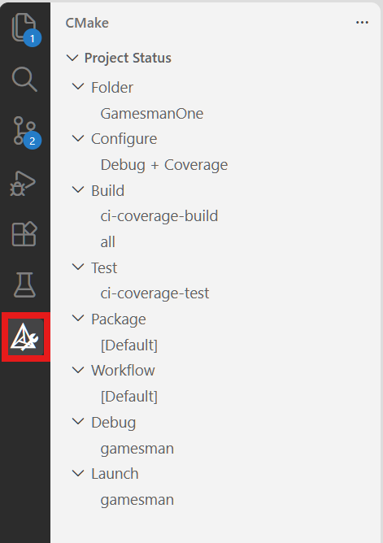
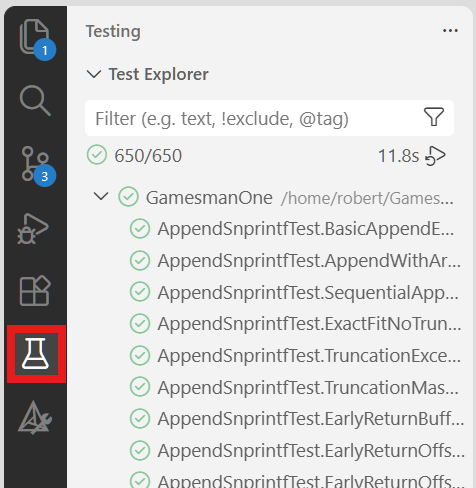
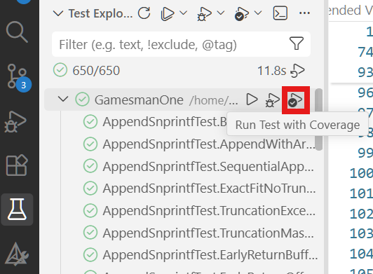
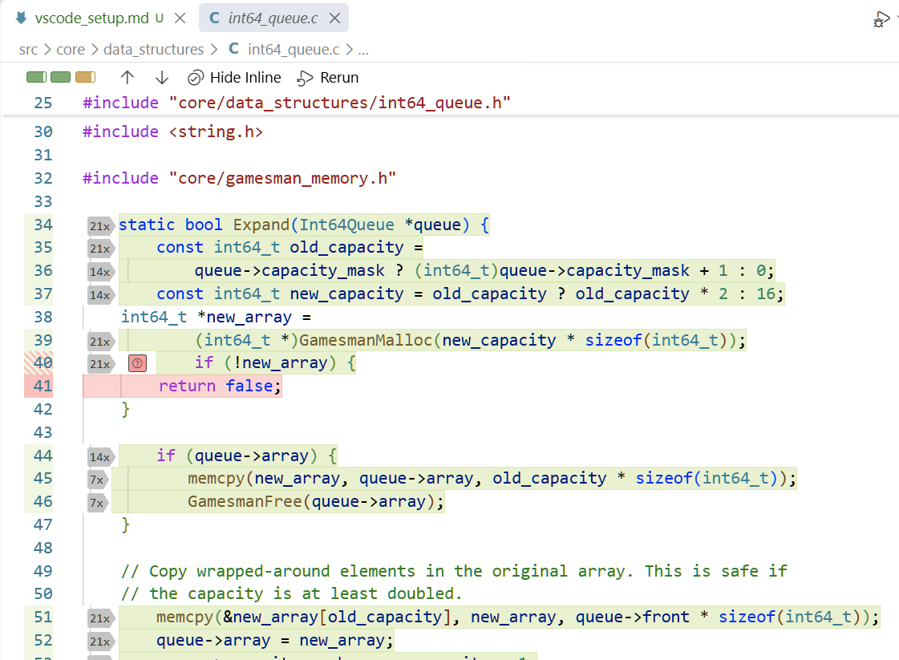
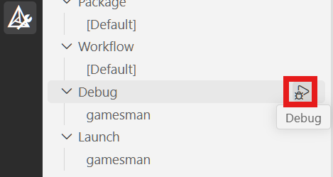

# Recommended VS Code Setup Guide

> [!NOTE]
> This guide is **optional and recommended**. GamesmanOne is built with standard CMake and Ninja toolchains and does **not** depend on Visual Studio Code or any specific IDE to build, run, or test. You can perform all tasks directly from the command line (see the [Setup Guide in README.md](../README.md#setup-guide)).

This document provides recommended configurations, extensions, and workflows for developers using [Visual Studio Code](https://code.visualstudio.com/) for GamesmanOne development.

---

## 1. Recommended Extensions

To get the best development experience with C/C++, CMake presets, Python scripts, and test runners, we recommend installing the following extensions from the VS Code Marketplace:

| Extension | Extension ID | Description |
| :--- | :--- | :--- |
| **C/C++** | `ms-vscode.cpptools` | Core C/C++ IntelliSense, code navigation, semantic colorization, and debugging support. |
| **C/C++ Extension Pack** | `ms-vscode.cpptools-extension-pack` | Bundles C/C++ language support, CMake Tools, and related utilities. |
| **C/C++ Themes** | `ms-vscode.cpptools-themes` | Enhanced syntax highlighting and semantic theme support for C and C++. |
| **CMake Tools** | `ms-vscode.cmake-tools` | CMake integration for VS Code. Enables preset loading, configuring, building, testing, and debugging directly from the primary sidebar and status bar. |
| **Python** | `ms-python.python` | Python language support, linting, formatting, and debugging. Useful when working on the web REST API service (`server.py`), automation scripts, or Python-based End-to-End (`pytest`) test suites. |
| **Output Colorizer** | `IBM.output-colorizer` | Syntax and keyword colorization in the Output panel, terminal traces, and build/test logs. |

You can install these extensions directly in VS Code via the Extensions view (`Ctrl+Shift+X` / `Cmd+Shift+X`) by searching for their IDs.

---

## 2. Recommended Workspace Settings

GamesmanOne includes a pre-configured workspace settings file located at [`scripts/.vscode/settings.json`](../scripts/.vscode/settings.json).

### Setup Instructions

To apply these recommended settings to your local workspace:

1. **Option 1 (Quick Setup):** Copy the provided `.vscode` directory into the root of the repository:
   ```bash
   cp -r scripts/.vscode .vscode
   ```
2. **Option 2 (Manual Merge):** If you already have a `.vscode/settings.json` with personal preferences, merge the contents of [`scripts/.vscode/settings.json`](../scripts/.vscode/settings.json) into your existing `.vscode/settings.json`.

Refer to [`scripts/.vscode/settings.json`](../scripts/.vscode/settings.json) for the complete configuration file. Below is an explanation of the key settings and why they are recommended:

- **`"C_Cpp.clang_format_path": "/usr/bin/clang-format"`**
  Points the C/C++ extension to the system `clang-format` binary. With the C/C++ extension installed, formatting C/C++ source files (e.g., via the `Format Document` command) automatically applies the style defined in [`.clang-format`](../.clang-format) using the exact same binary expected by the project's optional pre-commit hook.
> [!NOTE]
> While strict formatting rules are not actively enforced at this moment, using the C/C++ extension to apply the style defined in [`.clang-format`](../.clang-format) helps maintain formatting consistency across contributors.

- **`"C_Cpp.doxygen.sectionTags"`**
  Configures recognized Doxygen section tags for syntax highlighting, comment block auto-completion, and hover tooltips in C/C++ header and source files. This list aligns with the project's documentation standards specified in [Doxygen Conventions](doxygen_conventions.md).

- **`"cmake.automaticReconfigure": false`**, **`"cmake.configureOnEdit": false`**, **`"cmake.configureOnOpen": false`**
  Disables automatic CMake reconfiguration when opening the project or modifying files. This avoids disruptive background CMake re-runs and unnecessary CPU usage during development.

- **`"cmake.preRunCoverageTarget": "coverage-clean"`**
  Specifies the custom CMake target executed prior to running tests with coverage. `coverage-clean` resets coverage counters and captures a 0% baseline info file (defined in `cmake/gamesman_lcov.cmake`).

- **`"cmake.postRunCoverageTarget": "coverage-generate"`**
  Specifies the custom CMake target executed after tests complete. `coverage-generate` gathers execution metrics, merges them with the baseline, and filters out system/test headers to produce the final coverage report at `lcov.info`.

- **`"cmake.coverageInfoFiles": ["${command:cmake.buildDirectory}/lcov.info"]`**
  Instructs CMake Tools where to find the generated `lcov.info` file so VS Code can render code coverage statistics and in-editor line coverage highlights.

- **`"cmake.ctest.allowParallelJobs": true`**
  Permits CTest to run tests concurrently in parallel jobs according to available CPU cores, speeding up test execution cycles.

- **`"cmake.useCMakePresets": "always"`**
  Forces CMake Tools to use the presets defined in [`CMakePresets.json`](../CMakePresets.json), ensuring consistent build configurations across CLI and IDE environments.

- **`"testing.coverageToolbarEnabled": true`**
  Enables the coverage toolbar within VS Code's Testing Explorer view, making it easy to toggle inline coverage highlighting and inspect coverage metrics per file.

---

## 3. Developing with the CMake Tools Sidebar

Once the extensions and workspace settings are installed, the **CMake** icon will appear in the primary Activity Bar on the side of VS Code. CMake Tools will automatically operate with CMake Presets enabled.



### 3.1 Selecting a Preset and Building

1. **Choose a Configure Preset:**
   Click on the CMake icon in the Activity Bar to open the CMake Tools side panel. Click on the **Configure Preset** selector (or status bar item) and select your desired preset (e.g., `release`, `ci-asan`, or `ci-coverage`).

2. **Automatic Preset Population:**
   Because each configure preset in `CMakePresets.json` currently has at most one build or test preset, the corresponding **Build Preset** and **Test Preset** will populate automatically.

3. **Build the Project:**
   Click the **Build** button in the CMake sidebar (or press `F7` by default keyboard shortcuts) to compile the selected preset.

---

### 3.2 Running Unit Tests

To run GoogleTest unit tests via CMake Tools:

1. **Select a Test-Enabled Preset:**
   Choose a preset that has tests enabled, such as:
   - `ci-asan` (`RelWithDebInfo + ASan + UBSan`)
   - `ci-asan-st` (`RelWithDebInfo + ASan + UBSan (Single-Threaded)`)
   - `ci-coverage` (`Debug + Coverage`)
   - `ci-coverage-st` (`Debug + Coverage (Single-Threaded)`)

2. **Build the Preset:**
   Click **Build** to ensure the latest test binaries are compiled.

3. **Run Tests:**
   Click on the **Test** button (the test icon in the CMake sidebar).

4. **Inspect Test Results:**
   Open the **Testing** panel (the flask icon in the Activity Bar) to view individual test suites, test cases, and pass/fail statuses.

   

---

### 3.3 Running Tests with Line Coverage (Linux Only)

> [!NOTE]
> Line coverage via `gcov`/`lcov` is currently supported only on Linux.

To run tests with code coverage and visualize inline line coverage:

1. **Select a Coverage Preset:**
   Choose either `ci-coverage` or `ci-coverage-st` as your configure preset and build it.

2. **Run Coverage from the Test Collection Dropdown:**
   Navigate to the **Testing** panel. Locate the **GamesmanOne** test collection dropdown item. Click the **"Run Test with Coverage"** button directly next to the "GamesmanOne" header dropdown.

   

> [!IMPORTANT]
> As of the writing of this document, clicking the "Run Test with Coverage" icon at the very top next to **"Test Explorer"** will cause VS Code **not** to display inline coverage details in the editor, although coverage statistics will still be collected and shown in the sidebar. To view inline coverage highlights in source files, always use the button next to the **"GamesmanOne"** test collection dropdown.

3. **View Inline Coverage Highlights:**
   Open any source file (e.g., in `src/core/`) to see green/red gutter indicators and line highlighting indicating executed and unexecuted code lines (needs to be toggled on from the coverage toolbar).

   

---

### 3.4 Debugging with CMake Tools

To debug any compiled CMake target (such as `gamesman` or a unit test executable):

1. **Build with a Debug Preset:**
   Ensure you configure and build with a preset that uses the `Debug` build type (e.g., `ci-coverage`, `ci-coverage-st`, `ci-analyze-gcc`, or `ci-analyze-clang`).
> [!TIP]
> Look at the preset descriptions in `CMakePresets.json` to check the underlying CMake build type. Choose `Debug` so the compiler does not optimize lines out with optimizations.

2. **Start Debugging:**
   In the CMake Tools sidebar under the **Debug**, select your compiled target binary (e.g., `gamesman`) and click the **Debug** button.

   

   This requires much less setup than launching the debugger from the "Run and Debug" panel and is the preferred way.

3. Set breakpoints by clicking in the margin next to any line of code, and use the standard VS Code debugging controls (step over, step into, inspect variables, call stack, watch expressions).

